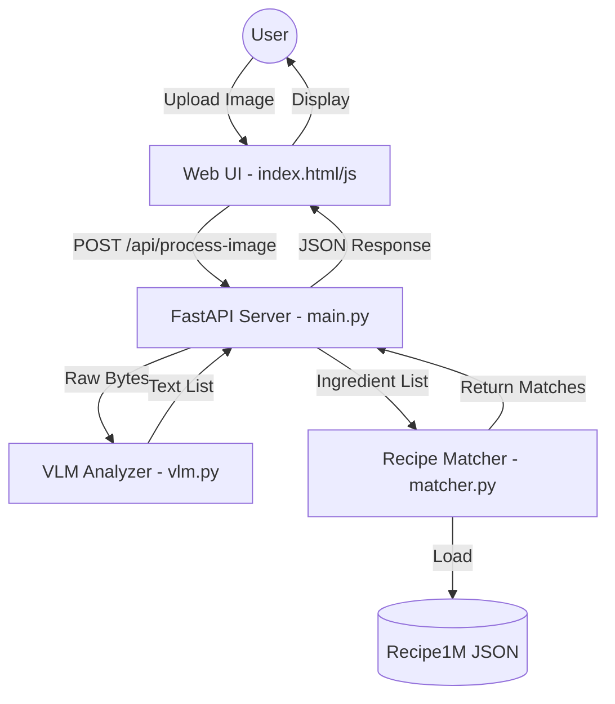

# SmartKitchen.AI Technical Overview

SmartKitchen.AI is an AI-powered culinary assistant that bridges the gap between the ingredients in your pantry and a database of over 1 million recipes. It uses a **Vision Language Model (VLM)** to identify ingredients from images and an optimized matching algorithm to suggest what you can cook.

## 1. System Architecture
The application follows a modern **FastAPI** backend structure with a vanilla JavaScript frontend. It is designed to handle high-latency AI tasks (like ingredient detection) while maintaining a responsive user interface.

---

## 2. Core Components

### 🟢 `app/main.py` (The Orchestra Leader)
This is the entry point of the FastAPI application.
- **Routing**: Defines endpoints for image processing (`/api/process-image`) and text-based searching (`/api/search-recipes`).
- **Initialization**: Instantiates the `RecipeMatcher` (loading the dataset into memory) and the `QwenVLAnalyzer` (loading the AI model).
- **Static Hosting**: Serves the frontend files (HTML, CSS, JS) from the `/static` directory.

### 🟢 `app/vlm.py` (The Eyes)
Handles the Vision Language Model logic.
- **Model**: Uses **Qwen2-VL-2B**, a powerful multimodal model.
- **Optimization**: Automatically detects GPU (MPS on Mac). Configured with **BFloat16** precision for a balance of speed and memory efficiency.
- **Task**: Executes the prompt: *"List the ingredients found in this image, separated by commas."*

### 🟢 `app/matcher.py` (The Brain)
Handles the recipe matching logic.
- **Dataset Loading**: Reads `processed_layer1.json`, keeping a configurable subset in memory for speed.
- **Matching Logic**:
    - **Staple Removal**: Ignores common items like "salt", "water", or "sugar" in coverage calculations.
    - **Strict Match**: Requires exact string matching after normalization.
- **Ranking**: Matches are ranked by **coverage** (percentage of recipe ingredients owned by the user).

---

## 3. Data Pipeline & Preprocessing

### 🛠️ `clean_dataset.py`
Converts raw Recipe1M data into a clean, searchable format.
- **Filters**: Removes non-dish recipes (mixes, extracts, rubs).
- **Normalization**: Strips units (oz, g, ml) and descriptors (chopped, minced) to leave core ingredient names.
- **Augmentation**: Scans instructions for ingredients missing from the formal list.

### 🛠️ `generate_glossary.py`
Powers the "Alphabetical Index" feature.
- **Aggregation**: Scans the dataset to count unique ingredient frequencies.
- **Grouping**: Organizes ingredients alphabetically to create `glossary.json`.

---

## 4. Frontend Design (`app/static/`)
- **`index.html`**: A premium, dark-themed UI utilizing glassmorphism.
- **`script.js`**: 
    - Manages drag-and-drop image uploads.
    - Handles "Detected Ingredients" state (add/remove items).
    - Renders dynamic recipe cards with match percentages and missing labels.

---

## 5. Summary of Workflow
1. **Preprocessing**: `clean_dataset.py` cleans the raw 1.4GB dataset.
2. **Startup**: `uvicorn` starts the server and loads the VLM model.
3. **Usage**:
    - User uploads a photo of their ingredients.
    - `vlm.py` detects the ingredients.
    - `matcher.py` finds the best-matching recipes.
    - UI displays results with a focus on "What's missing?".
